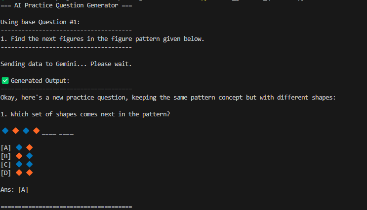
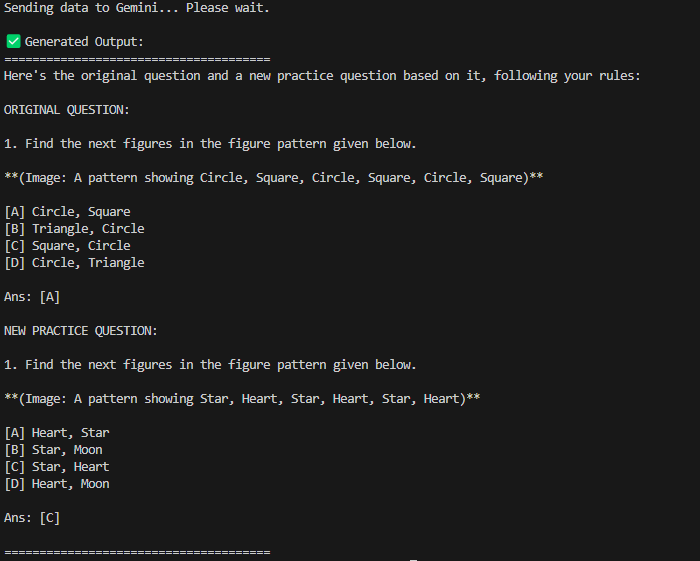

# PyMuPDF-Gemini-Pipeline

A Python pipeline that uses PyMuPDF to extract text and images from a PDF and then leverages the Gemini AI API to generate new, similar questions.

---

## 📘 Overview

This project is an end-to-end data processing pipeline designed to parse educational PDF documents and use their content to generate new, contextually-aware questions using artificial intelligence. The system is composed of two primary scripts:

### 🔹 `extractor.py`
- Core of the data extraction phase.
- Processes a source PDF file and intelligently identifies individual questions.
- Distinguishes between:
  - Question text
  - Question images
  - Option images
- Filters out irrelevant content like:
  - Page numbers
  - Headers
  - Background watermarks
- Outputs a clean, structured `questions_final.json` file.

### 🔹 `ai_generate_question.py`
- Interfaces with the **Google Gemini API**.
- Takes structured data from the JSON file.
- Sends both text and associated images of a selected question to Gemini AI.
- Instructs the model to generate a **new, similar practice question**.

---

## ✨ Features

✅ **Intelligent Content Extraction**  
Parses PDFs and accurately isolates individual questions, even if they span multiple pages.

✅ **Visual and Textual Association**  
Correctly links images to their questions and distinguishes between question and option images.

✅ **Advanced Noise Filtering**  
Ignores large background images, watermarks, and section headers for clean extraction.

✅ **Robust Data Structuring**  
Produces a clean JSON format for easy use in AI models or other applications.

✅ **AI-Powered Content Generation**  
Uses **Gemini’s multimodal capabilities** to generate new questions based on both text and visuals.

---

## 🤖 AI-Generated Output Showcase

The `ai_generate_question.py` script demonstrates how the extracted content is used as input to generate new educational questions using Gemini.

**Example 1:**  


**Example 2:**  


---

## 📂 Project Structure

```plaintext
/
├── extractor.py               # Script to parse the PDF and extract content
├── ai_generate_question.py    # Script to generate a new question using the AI
├── sample.pdf                 # An example input PDF file
├── README.md                  # This project description file
├── final_output/              # Directory containing extracted JSON and images
│   └── questions_final.json
│   └── ... (image assets)
├── Gemini_output_1.png        # Screenshot of AI-generated output
├── Gemini_output_2.png        # Screenshot of AI-generated output
